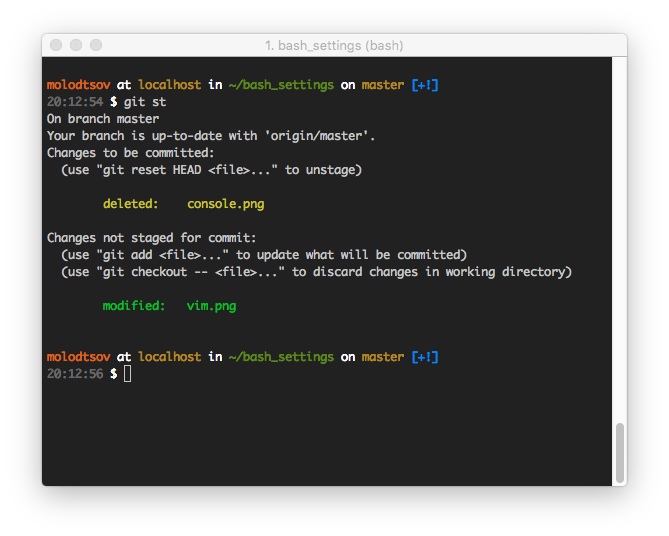
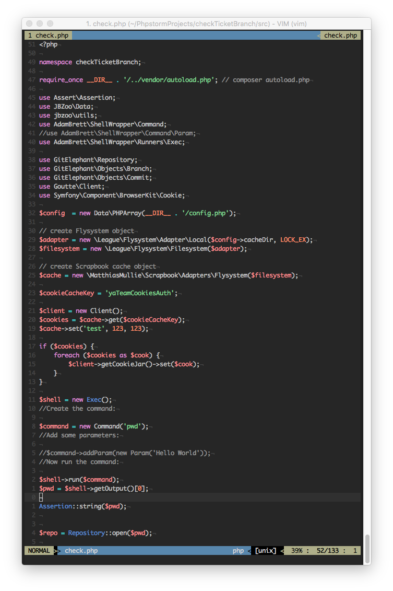

# OKOPOK’s dotfiles





## Installation

Это форк репозитория [Mathias Bynens](https://github.com/mathiasbynens/dotfiles)

**Warning:** If you want to give these dotfiles a try, you should first fork this repository, review the code, and remove things you don’t want or need. Don’t blindly use my settings unless you know what that entails. Use at your own risk!

### Using Git and the bootstrap script

You can clone the repository wherever you want. (I like to keep it in `~/Projects/dotfiles`, with `~/dotfiles` as a symlink.) The bootstrapper script will pull in the latest version and copy the files to your home folder.

```bash
git clone --recursive https://github.com/okopok/dotfiles.git && cd dotfiles && source init.sh
```

To update, `cd` into your local `dotfiles` repository and then:

```bash
source init.sh
```
### Git-free install

To install these dotfiles without Git:

```bash
cd; curl -#L https://github.com/okopok/dotfiles/tarball/master | tar -xzv --strip-components 1 --exclude={README.md,bootstrap.sh,LICENSE-MIT.txt}
```

To update later on, just run that command again.

### Specify the `$PATH`

Here’s an example `~/.bash_path` file that adds `/usr/local/bin` to the `$PATH`:

```bash
export PATH="/usr/local/bin:$PATH"
```

### Add custom commands without creating a new fork

If `~/.bash_extra` exists, it will be sourced along with the other files. You can use this to add a few custom commands without the need to fork this entire repository, or to add commands you don’t want to commit to a public repository.

My `~/.bash_extra` looks something like this:

```bash
# Git credentials
# Not in the repository, to prevent people from accidentally committing under my name
GIT_AUTHOR_NAME="Sasha Molodtsov"
GIT_COMMITTER_NAME="$GIT_AUTHOR_NAME"
git config --global user.name "$GIT_AUTHOR_NAME"
GIT_AUTHOR_EMAIL="molodtsov.sasha@gmail.com"
GIT_COMMITTER_EMAIL="$GIT_AUTHOR_EMAIL"
git config --global user.email "$GIT_AUTHOR_EMAIL"
```

You could also use `~/.bash_extra` to override settings, functions and aliases from my dotfiles repository. It’s probably better to [fork this repository](https://github.com/mathiasbynens/dotfiles/fork) instead, though.

### Vim 

if you get some vim\vi erorrs, on startup, try to update vim like theese

```
vi .vimrc
Error detected while processing /home/durrantm/.vimrc:
line   20:
E319: Sorry, the command is not available in this version: autocmd BufWritePre *.rb :%s/\s\+$//e
line   24:
E519: Option not supported: filetype 
line   25:
E319: Sorry, the command is not available in this version: filetype plugin on
line   26:
E319: Sorry, the command is not available in this version: filetype indent on
line   27:
E319: Sorry, the command is not available in this version: syntax on " Turn on syntax highlighting
line   37:
E319: Sorry, the command is not available in this version: match ExtraWhitespace /\s\+$/
line   38:
E319: Sorry, the command is not available in this version: autocmd BufWinEnter * match ExtraWhitespace /\s\+$/
line   39:
E319: Sorry, the command is not available in this version: autocmd InsertEnter * match ExtraWhitespace /\s\+\%#\@
<!$/
line   40:
E319: Sorry, the command is not available in this version: autocmd InsertLeave * match ExtraWhitespace /\s\+$/
line   41:
E319: Sorry, the command is not available in this version: autocmd BufWinLeave * call clearmatches()
line   48:
E319: Sorry, the command is not available in this version: let mapleader = ","
line   52:
E518: Unknown option: foldmethod=indent
line   53:
E518: Unknown option: foldnestmax=10
line   54:
E518: Unknown option: nofoldenable
line   55:
E518: Unknown option: foldlevel=1
line   57:
E319: Sorry, the command is not available in this version: let loaded_matchparen = 1 " MDD Turn off matching brac
ket highlighting.
line   58:
E319: Sorry, the command is not available in this version: filetype plugin indent on
```

```
apt-get install vim
```
and then in vim window type `:BundleInstall`

### Install Homebrew formulae

When setting up a new Mac, you may want to install some common [Homebrew](http://brew.sh/) formulae (after installing Homebrew, of course):

```bash
./brew.sh
```

## Feedback

Suggestions/improvements
[welcome](https://github.com/okopok/dotfiles/issues)!

## Author

[Саша Молодцов](https://fb.com/okopok)


## Thanks to

| [](http://twitter.com/mathias "Follow @mathias on Twitter") |
|---|
| [Mathias Bynens](https://mathiasbynens.be/) |

* @ptb and [his _OS X Lion Setup_ repository](https://github.com/ptb/Mac-OS-X-Lion-Setup)
* [Ben Alman](http://benalman.com/) and his [dotfiles repository](https://github.com/cowboy/dotfiles)
* [Chris Gerke](http://www.randomsquared.com/) and his [tutorial on creating an OS X SOE master image](http://chris-gerke.blogspot.com/2012/04/mac-osx-soe-master-image-day-7.html) + [_Insta_ repository](https://github.com/cgerke/Insta)
* [Cătălin Mariș](https://github.com/alrra) and his [dotfiles repository](https://github.com/alrra/dotfiles)
* [Gianni Chiappetta](http://gf3.ca/) for sharing his [amazing collection of dotfiles](https://github.com/gf3/dotfiles)
* [Jan Moesen](http://jan.moesen.nu/) and his [ancient `.bash_profile`](https://gist.github.com/1156154) + [shiny _tilde_ repository](https://github.com/janmoesen/tilde)
* [Lauri ‘Lri’ Ranta](http://lri.me/) for sharing [loads of hidden preferences](http://osxnotes.net/defaults.html)
* [Matijs Brinkhuis](http://hotfusion.nl/) and his [dotfiles repository](https://github.com/matijs/dotfiles)
* [Nicolas Gallagher](http://nicolasgallagher.com/) and his [dotfiles repository](https://github.com/necolas/dotfiles)
* [Sindre Sorhus](http://sindresorhus.com/)
* [Tom Ryder](http://blog.sanctum.geek.nz/) and his [dotfiles repository](https://github.com/tejr/dotfiles)
* [Kevin Suttle](http://kevinsuttle.com/) and his [dotfiles repository](https://github.com/kevinSuttle/dotfiles) and [OSXDefaults project](https://github.com/kevinSuttle/OSXDefaults), which aims to provide better documentation for [`~/.osx`](https://mths.be/osx)
* [Haralan Dobrev](http://hkdobrev.com/)
* anyone who [contributed a patch](https://github.com/mathiasbynens/dotfiles/contributors) or [made a helpful suggestion](https://github.com/mathiasbynens/dotfiles/issues)
